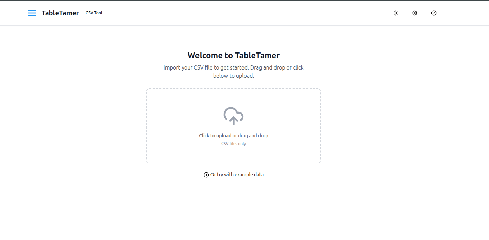

# TableTamer

A browser-based CSV visualization and transformation tool that converts raw CSV data into beautiful, interactive tables. TableTamer helps users quickly analyze, manipulate, and transform tabular data without requiring any back-end services.



## Live Demo

[View Live Demo (Coming Soon)](https://tabletamer.example.com)

## Features

- **File Handling**
  - Drag-and-drop CSV file upload zone with visual feedback
  - Traditional file input as fallback for older browsers
  - Loading indicators during file processing
  - Support for large CSV files with graceful handling
  - Example data option for quick testing

- **Interactive Table Display**
  - Responsive, interactive table with fixed headers
  - Pagination with configurable page size (10, 25, 50, 100 rows)
  - Column sorting (ascending/descending) with visual indicators
  - Column resizing via drag handles
  - Inline cell editing with one-click access

- **Data Manipulation**
  - Global search functionality across all columns
  - Column visibility toggle with easy management
  - Text transformations (UPPERCASE, lowercase, Title Case)
  - Cell value editing with validation
  - Data persistence between sessions using localStorage

- **Export Functionality**
  - Export to CSV with proper escaping and formatting
  - Export to JSON with configurable options
  - Copy to clipboard functionality for quick sharing
  - Export filtered/visible data only option

- **User Experience**
  - Light/dark mode toggle with system preference detection
  - Clean, intuitive UI with proper spacing and typography
  - Helpful tooltips and informative empty states
  - Keyboard shortcuts for power users
  - Error boundaries for graceful error handling

## Technology Stack

- **Frontend Framework**: React 18 with functional components and hooks
- **Styling**: TailwindCSS with shadcn/ui components for consistent UI
- **CSV Handling**: PapaParse for robust CSV parsing and generation
- **File Handling**: FileSaver.js for client-side file saving
- **State Management**: React Context API for global application state
- **Build Tools**: Vite for fast development and optimized production builds
- **Type Safety**: TypeScript for better developer experience and code quality

## Installation

1. Clone the repository:
   ```bash
   git clone https://github.com/0xwulf/tabletamer.git
   cd tabletamer
   ```

2. Install dependencies:
   ```bash
   npm install
   ```

3. Start the development server:
   ```bash
   npm run dev
   ```

4. Open your browser to the URL shown in the terminal (typically http://localhost:5000)

## Usage Guide

### Importing Data

- **Upload CSV**: Drag and drop a CSV file onto the upload zone or click to select a file
- **Example Data**: Click "Try with example data" to load sample data for testing

### Working with Table Data

- **Sort Columns**: Click on column headers to sort (click again to reverse sort order)
- **Filter Data**: Use the search box to filter across all columns
- **Manage Columns**: Click the "Columns" button to show/hide specific columns
- **Edit Cells**: Click on any cell to edit its content
- **Resize Columns**: Drag the divider between column headers to resize

### Exporting Data

- **Export Options**: Click the "Export" button to see available export formats
- **CSV Export**: Choose "Export as CSV" to download as CSV file
- **JSON Export**: Choose "Export as JSON" to download as JSON file
- **Copy to Clipboard**: Choose "Copy to clipboard" to copy the data

### Keyboard Shortcuts

| Action | Shortcut |
|--------|----------|
| Search | Ctrl + F |
| Column Manager | Ctrl + M |
| Next Page | → |
| Previous Page | ← |
| Export as CSV | Ctrl + E |
| Toggle Theme | Ctrl + D |
| Show Keyboard Shortcuts | Ctrl + K |

## Future Roadmap

### Version 1.1.0 (Planned)
- Column reordering via drag-and-drop
- Advanced filtering options for specific column types
- Column type detection with appropriate formatting

### Version 1.2.0 (Planned)
- Basic data visualization (histograms, bar charts)
- Summary statistics for numeric columns
- Data transformation history with undo/redo

### Version 2.0.0 (Future)
- Import from different file formats (Excel, JSON)
- Custom column type definitions and validations
- Collaborative editing via WebSockets
- User-defined templates and presets

## Contributing

Contributions are welcome! Please feel free to submit a Pull Request.

1. Fork the project
2. Create your feature branch (`git checkout -b feature/amazing-feature`)
3. Commit your changes (`git commit -m 'Add some amazing feature'`)
4. Push to the branch (`git push origin feature/amazing-feature`)
5. Open a Pull Request

## Contact

- **Author**: 0xWulf
- **Email**: dev@0xwulf.dev
- **GitHub**: [github.com/0xwulf](https://github.com/0xwulf)

## License

This project is licensed under the MIT License - see the [LICENSE](LICENSE) file for details.
