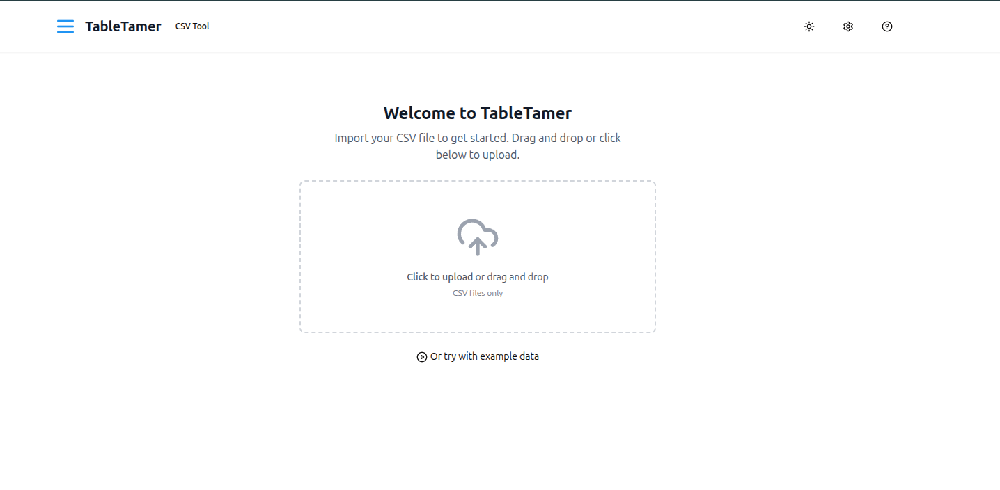

# 📊 TableTamer

TableTamer is a polished CSV workbench for the browser. Drop in a CSV file and it turns into a searchable, sortable, editable table with column controls, pagination, theme support, clipboard export, and local session persistence.



## ✨ Current State

TableTamer is currently a client-first React application served by a lightweight Express wrapper.

What works today:

- 📂 Drag-and-drop CSV upload
- 🧪 Example dataset loading
- 🔎 Global table search
- ↕️ Column sorting
- ↔️ Column resizing
- 👁️ Column visibility management
- ✍️ Inline cell editing
- 🔤 Cell text transforms: uppercase, lowercase, title case, clear
- 📄 Pagination with configurable page sizes
- 💾 Session restore via `localStorage`
- 📤 Export filtered visible data as CSV or JSON
- 📋 Copy filtered visible data to clipboard
- 🌗 Light and dark theme toggle
- ⌨️ Keyboard shortcuts for common actions
- 🛡️ Error boundary protection in the UI
- 🚦 Production server protections such as Helmet, compression, CORS, and rate limiting

What it is not today:

- It is not a multi-user or collaborative system.
- It does not currently expose a meaningful public API.
- It includes database-related packages and scaffolding, but the active app flow is centered on in-browser CSV handling.

## 🧱 Architecture

The repository is split into a small server layer and a browser app:

- `client/`: React SPA built with Vite
- `server/`: Express server for production delivery and middleware
- `shared/`: shared TypeScript schema/types
- `public/`: favicons and static site assets
- `screenshots/`: project screenshots used in docs

The app’s core state lives in `client/src/context/TableContext.tsx`, which owns CSV ingestion, filtering, sorting, pagination, editing, exports, clipboard behavior, and persisted session restore.

## 🛠️ Full Tech Stack

### Frontend

- ⚛️ React 18
- 🧠 TypeScript
- ⚡ Vite 7
- 🧭 Wouter for routing
- 📊 TanStack Table for table mechanics
- 🔄 TanStack Query installed for async/query infrastructure
- 🎨 Tailwind CSS
- 🧩 shadcn/ui style component architecture
- 🧱 Radix UI primitives
- 🌙 `next-themes` for theme management
- 🖼️ Lucide React icons

### Data Handling

- 🧾 PapaParse for CSV parsing and CSV export generation
- 💽 Browser `localStorage` for session persistence
- 📋 Clipboard API with fallback support for copy operations

### Server / Runtime

- 🚂 Express 4
- 🗜️ `compression`
- 🪖 `helmet`
- 🌐 `cors`
- 🚥 `express-rate-limit`
- 🪵 Winston logging
- 🔧 `tsx` for local development runtime
- 📦 `esbuild` for bundling the production server entry

### Deployment / Ops

- ♻️ PM2 ecosystem config included for process management
- 🐧 Node.js 18+ supported
- 🧰 Husky + lint-staged configured for local workflow hygiene

### Additional Installed Packages

The repository also includes packages for forms, validation, charts, sessions, Drizzle ORM, and other UI primitives. Some of these are currently unused in the active CSV workflow, but they are present in the repo and may support future work.

## 🚀 Getting Started

### 1. Clone the repo

```bash
git clone https://github.com/hexawulf/tabletamer.git
cd tabletamer
```

### 2. Install dependencies

```bash
npm install
```

### 3. Configure environment variables

Copy the example file:

```bash
cp .env.example .env
```

Current environment values supported by the app:

- `PORT`: server port, defaults to `5000`
- `NODE_ENV`: `development` or `production`
- `LOG_FILE_PATH`: Winston log destination
- `ALLOWED_ORIGINS`: comma-separated CORS allowlist
- `DATABASE_URL`: present for DB tooling/scaffolding

### 4. Start development mode

```bash
npm run dev
```

### 5. Build for production

```bash
npm run build
```

### 6. Start the production build

```bash
npm run start
```

## 🖥️ Available Scripts

```bash
npm run dev      # start the app in development mode
npm run build    # build the client and bundle the server
npm run start    # run the production server from dist/
npm run check    # run TypeScript checks
npm run lint     # lint client, server, and shared code
npm run format   # format project files with Prettier
npm run db:push  # push Drizzle schema changes
```

## 🧪 User Workflow

### Import

- Drag a `.csv` file onto the upload area, or click to browse
- Use the built-in example dataset if you just want to test the UI quickly

### Explore

- Search across all visible data
- Sort by clicking a column header
- Resize columns by dragging the header handle
- Toggle visible columns from the Columns dialog

### Edit

- Click any cell to open the editor
- Save direct text changes
- Apply text transforms before saving

### Export

- Export the current filtered and visible data to CSV
- Export the current filtered and visible data to JSON
- Copy the current filtered and visible data to the clipboard

## ⌨️ Keyboard Shortcuts

TableTamer supports keyboard shortcuts for fast navigation and control:

| Action                | Shortcut       |
| --------------------- | -------------- |
| Focus search          | `Ctrl/Cmd + F` |
| Open column manager   | `Ctrl/Cmd + M` |
| Export CSV            | `Ctrl/Cmd + E` |
| Toggle theme          | `Ctrl/Cmd + D` |
| Show shortcuts dialog | `Ctrl/Cmd + K` |
| Next page             | `→`            |
| Previous page         | `←`            |
| Clear search          | `Esc`          |

## 🔐 Security and Operational Notes

- Helmet is enabled in production
- API-prefixed routes are rate-limited
- Response compression is enabled
- CORS can be restricted with `ALLOWED_ORIGINS`
- Server startup and request flow are logged through Winston

See [SECURITY_AUDIT.md](SECURITY_AUDIT.md) for prior security cleanup notes.

## 🧭 Roadmap Ideas

Potential next steps that would fit the current codebase well:

- Column reordering
- Better type-aware rendering and sorting
- Advanced per-column filters
- Undo/redo for edits
- Richer table summaries and lightweight visualizations
- Removal of unused package/dependency surface

## 🤝 Contributing

Contributions are welcome. If you are making changes, keep the app working, keep the docs honest, and prefer small, testable improvements over speculative feature sprawl.

Basic flow:

1. Fork the repo
2. Create a branch
3. Make and verify your changes
4. Open a pull request

## 📫 Project Info

- Author: 0xWulf
- Email: `dev@0xwulf.dev`
- Repository: [github.com/hexawulf/tabletamer](https://github.com/hexawulf/tabletamer)

## 📄 License

This project is licensed under the [MIT License](LICENSE).  
You can also read the standard MIT license text at [opensource.org/licenses/MIT](https://opensource.org/licenses/MIT).
